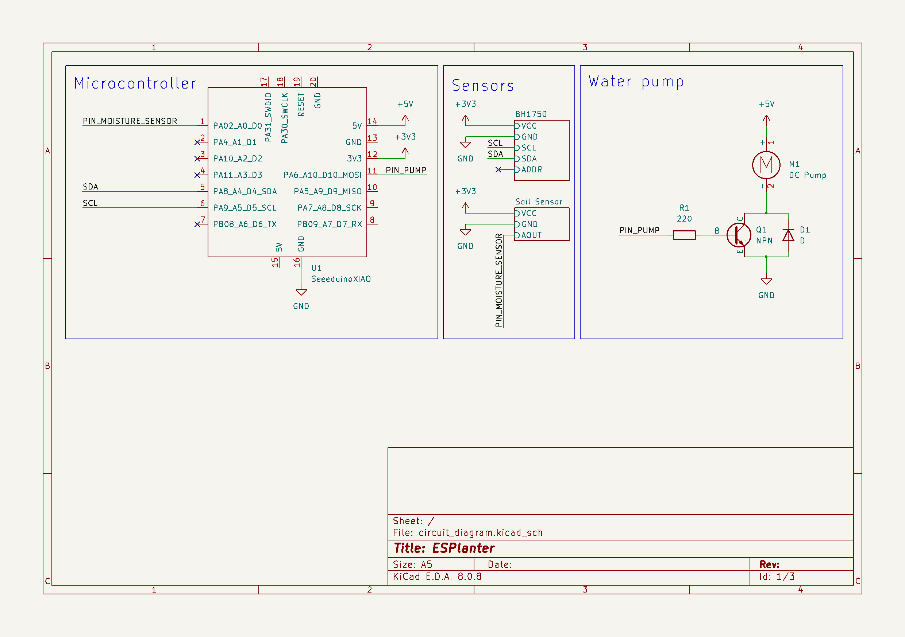

# ESPlanter - An ESP32-based smart planter system for use with Homeassistant

A smart planter based on an ESP32 which integrates to homeassistant using
the MQTT integration and by sending an auto-discovery message.

The planter itself does not decide on when water is needed. It only exposes its
sensors and a button (to trigger the pump) for the homeassistant server to control.

## Required Parts:
- 1x Seeed XIAO ESP32C3
  (If you want to use a different device, modify the platformio.ini file)
- 5V Mini 360 Self-priming water pump
- 1x NPN Transistor which can handle the pump current.
  I used a BC107A because I had a couple already.
- 1x BH1750 light sensor
- 1x Capacitive Soil moisture sensor
- 1x 220 Ohm resistor
- 1x Diode
- Connectors if you want to use them
- Flexible tube for the water pump. Mine has an inner diameter of 4mm but make sure
  to check your pump if you require a different diameter.

## Circuit diagram

## Setup
After flashing the device open the serial monitor to configure it.
Type `help` and confirm by pressing enter, to list all available commands.
Type `list` to print all currently supported configuration values and their current
values.

By typing `set <config value name>:<value>` you can change the value of these entries
for your particular setup. Important values to configure are the WiFi SSID and
password, the MQTT broker address as well as the username and password if your server
requires authentication.

## Calibrating the soil sensor
In order for the soil sensor to measure sensible values it needs to be calibrated.
To do this, use the serial interface and type the command `read_moisture_sensor`.
This will print the currently measured moisture as a percentage as well as the
raw value read by the ADC.

1. While the sensor is perfectly dry, obtain a raw sensor reading and set this
   as the upper limit (using the method described in [Setup](#setup)).
2. Take a cup of water and insert the sensor up to the printed line on the circuit
   board. Take another raw sensor reading and set this value as the lower limit.
3. Take a new sensor reading while the sensor is still in the water cup.
   The percentage should now show approximately 100% moisture.